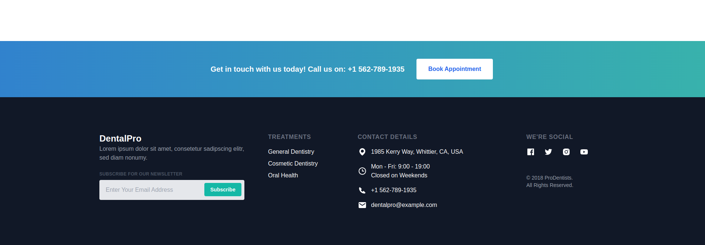
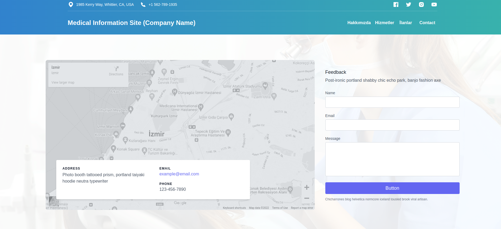

# Vue 3 + Vite

This template should help get you started developing with Vue 3 in Vite. The template uses Vue 3 `<script setup>` SFCs, check out the [script setup docs](https://v3.vuejs.org/api/sfc-script-setup.html#sfc-script-setup) to learn more.


## Features
- [Vue 3](https://v3.vuejs.org/)
- [Vite](https://vitejs.dev/)
- [Pinia](https://pinia.esm.dev/)
- [Vue Router](https://next.router.vuejs.org/)
- [Tailwind CSS](https://tailwindcss.com/)
- [VueUse](https://vueuse.org/)
- [Vue Meta](https://vue-meta.vuejs.org/)
- [Vue Devtools](daisyui.com)

##
 <!-- demo url -->
 ## Url
[Demo](https://vue3-vite-pinia-tailwindcss-promotional-site.vercel.app/)


## Project setup

```
npm install
```

### Compiles and hot-reloads for development

```
npm run dev
```

### Compiles and minifies for production

```
npm run build
```

### Lints and fixes files

```
npm run lint
```

### Customize configuration

See [Configuration Reference](https://vitejs.dev/config/).

## Project structure

```
├── public
│   ├── favicon.ico
├── src
│   ├── assets
│   │   └── for-github
│   │       ├── contact.png
│   │       ├── dashboard.png
│   │       └── footer.png
│   ├── components
│   │   ├── dropdown
│   │   │   ├── AdsDropdown.vue
│   │   │   ├── ServicesDropdown.vue
│   │   ├── layout
│   │   │   ├── About.vue
│   │   │   ├── Blog.vue
│   │   │   ├── Cta.vue
│   │   │   ├── Footer.vue
│   │   │   ├── Header.vue
│   ├── pages
│   │   ├── Contact.vue
│   │   ├── Dashboard.vue
│   │   ├── About.vue
│   ├── main.js
│   ├── router.js
│   ├── style.css
│   ├── App.vue


```

<!-- add image -->




